### Hi there! I am Samantha Haak 👋

- 🌱 I’m currently learning Python and WEB3
- 👯 I’m looking to collaborate on Open Source projects
- 📫 How to reach me: samantha.albano@gmail.com
- 😄 Pronouns: she/her

             

         
      
 

 
